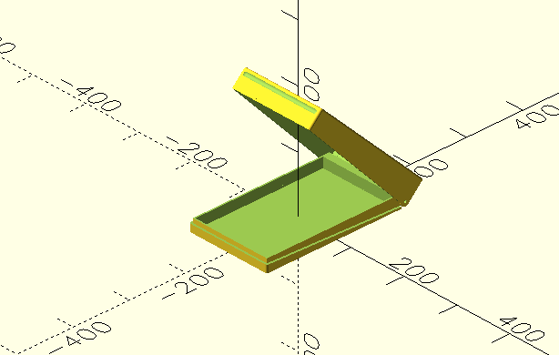

# universal_hinged_case

Creates a splashproof 3D hinged case arround object to be used for outdoor wall mount:

The Belfry OpenScad Library, v2 is used, so needs to be installed (https://github.com/BelfrySCAD/BOSL2)

Additional parts needed:
 * 2x magnets 20x10x2-mm-n45-nickel 
 * 2x M2x30 cylinder head screw

##NOTE: For simple use just copy "universal_hinged_case.scad" file to OpenSCAD library folder (https://en.wikibooks.org/wiki/OpenSCAD_User_Manual/Libraries) 
